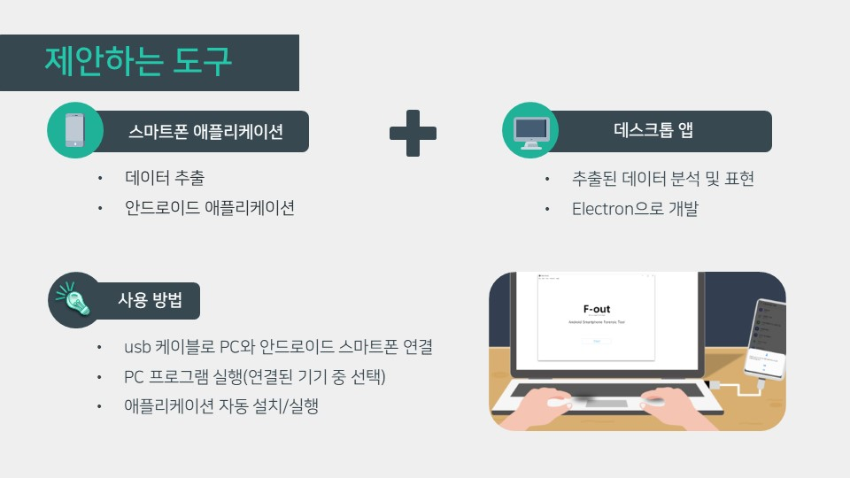
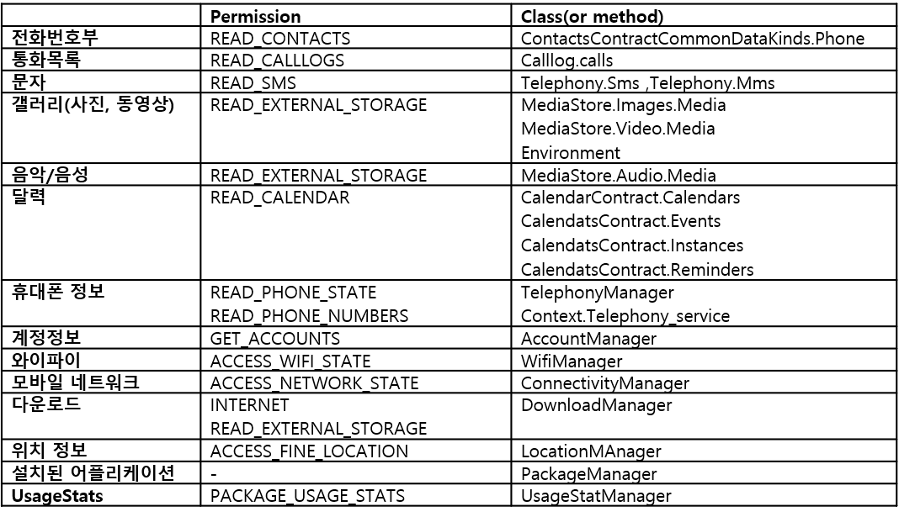

# Smartphone-mobile-forensic-tool
[2020_1 capstone design2] 안드로이드 스마트폰 모바일 포렌식 도구 개발   
### 개요
> 스마트폰은 사용자가 24시간 휴대하는 모바일 기기로 통화기록, 문자기록, 앱 사용기록, 사진, 비디오 등 다양한 흔적 데이터를 가진다. 이러한 데이터를 수집 및 분석하여 사용자에 대한 유의미한 정보를 얻을 수 있다. 본 연구는 루팅 하지 않은 안드로이드 기반 스마트폰을 대상으로 포렌식을 수행하는 데스크톱 앱 형태의 Smartphone Mobile Forensic Tool을 제안한다. 안드로이드 애플리케이션에서 API를 이용해 데이터를 추출하고, PC 포렌식 프로그램에서 획득한 데이터를 통합, 6가지 주제로 분석하여 시각화 하도록 구성한다.
  
### 캡스톤 디자인 1, 2
* 캡스톤 디자인 1
> 디지털 포렌식 툴 개발을 목적으로 안드로이드 스마트폰 데이터 추출 방법에 대한 연구 진행
> 1. Content Provider
> 2. Adb backup
> 3. Apk decompile & repackaging
> 4. Rooting
>    
> 안드로이드 데이터 추출 어플 개발 
> (Content Provider 를 이용해 추출 가능 데이터)   

* 캡스톤 디자인 2
> Smartphone digital forensic tool 개발 (추출 데이터 분석) 
> + 데이터 추출 어플을 통해 데이터 추출 후,추출한 데이터를 데스크톱 앱으로 가져와 데이터 분석 진행
> + 단순 데이터 값들을 다양한 관점에서 분석하고 시각화   

### 제안하는 포렌식 도구
> 데이터 추출을 위한 안드로이드 애플리케이션과 추출된 데이터를 분석 및 표현하는 데스크톱 앱의 형태로 구성한다. 데스크톱 앱은 electron 프레임워크를 활용하여 개발하고, 사용한 개발 언어는 javascript, html, css, python이다.  안드로이드 애플리케이션에서 데이터를 추출하여 내부 저장 공간 데이터베이스에 저장하고, PC에서 애플리케이션을 백업하여 데이터베이스 파일을 획득, 분석한다.    
> 
>> </img>   

### 데이터 추출   
> 앞서 진행한 ‘안드로이드 스마트폰 정보 추출 방법에 관한 연구’를 기반으로 데이터를 추출한다. 제시한 4가지 방법 중 Content Provider를 통해 데이터를 추출하는 안드로이드 API와 PC에서 기기와 통신할 수 있도록 하는 adb 도구의 backup 기능을 활용한다. API를 통해 추출 가능한 데이터 중 본 연구에서 활용할 데이터는 다음과 같다
>> </img>    
> 
> usb 케이블로 PC에 안드로이드 스마트폰을 연결하고 PC 프로그램을 실행하면 연결된 기기 중 포렌식을 진행할 기기를 선택한다. 해당 기기에 안드로이드 애플리케이션을 설치 · 실행하여 데이터를 추출한다. 안드로이드 애플리케이션에서는 사용자 권한을 요청하고 uri와 query 문을 통해 데이터를 요청해 SQLite 데이터베이스에 획득한 데이터를 저장한다. 애플리케이션 내부에 데이터베이스 구성이 완료되면 소켓 통신을 통해 PC 프로그램에 알림을 전달한다. adb 백업 방법을 통해 PC에서 애플리케이션 내부에 생성된 데이터베이스를 획득하고 분석을 이어간다. 안드로이드 애플리케이션의 설치, 실행 및 백업 과정은 PC 프로그램의 동작으로 편입하여 모두 자동화한다.   
### 데이터 분석
> 획득 한 데이터는 다음의 6가지 주제로 세부 분석한다.
> 1. 사용자 연락 분석
>> 통화 목록, 연락처, 문자 데이터를 통합하여 사용자 연락 패턴, 상대와의 상호작용을 분석했다.
>> * 사용자 연락 패턴 분석 및 상대와의 상호작용 분석  
>> 통화 및 문자 기록의 통계와 목록, 연락 수 기준 순위 분석, 연락 시간대 분석, 문자 답장 시간 분석을 진행하였다. 특정 기간 혹은 특정 연락처와의 연락기록을 분석할 수 있다.
>> 사용자의 연락 패턴에 대한 인사이트를 제공하고, 사용자의 인간관계와 주 활동 시간대, 상대와의 친밀도를 파악할 수 있다.
> 2. 문자 키워드 분석
>> 문자는 통화 기록과 달리 주고받은 내용이 기기에 보존되고, 특히 SMS 결제 알림 문자의 경우 지출 금액, 날짜, 카드, 사용처 정보를 포함하므로 추가적으로 분석했다.
>> * 문자 키워드 분석  
>> KoNLPy의 Twitter 패키지를 활용하여 문자 본문의 명사형 키워드를 추출했다. 문자 164건을 분석하는데 19초가 소요되었다.
>> 전체 문자의 키워드 목록을 출력하여 조회 및 검색할 수 있도록 하였다. 최근 및 전체, 특정 기간, 특정 연락처와의 문자에 대해 언급 횟수가 많은 상위 20개의 키워드를 차트로 구성하였다. 특정 항목 선택 시 해당 키워드가 언급된 문자의 목록을 확인할 수 있도록 하였다.
>> * 결제 문자 분석
>> 은행사 번호에서 전송된 문자 목록을 분석하여 결제 카드, 결제 금액, 할부 정보, 사용처 정보, 결제 일시 정보를 추출했다.
>> 결제 문자 목록 및 통계를 제시하여 결제를 상세 조건으로 검색 및 조회하도록 하였다. 결제 시간대 분석, 카드 및 이용처 순위 분석을 통해 사용자의 주 활동 시간대와 관심사를 파악할 수 있다.
> 3. 앱 사용 분석
>> 설치된 애플리케이션의 정보와 애플리케이션의 사용 정보를 이용하여 애플리케이션 리스트와 세부정보, 삭제된 애플리케이션 리스트, 최근 10일간 사용 분석 메뉴를 제공한다.
>> * 설치된 애플리케이션의 리스트  
>> 설치된 애플리케이션의 목록을 리스트로 제공한다. 사용시간, 실행시간, 네트워크 사용량 순으로 정렬이 가능하고 리스트에서 클릭하면 어플리케이션에 대한 세부 정보를 확인할 수 있다.
>> * 삭제된 애플리케이션  
>> 얻을 수 있는 삭제한 앱의 목록을 제공하고 팝업으로 google play store에서 해당 앱을 검색할 수 있다.
>> * 최근 사용 
>> 최근 열흘 간 사용 시간 상위 10개 앱의 순위 와 일별 사용 시간, 날짜 별 사용 앱 목록 제공한다. 
> 4. 미디어 저장공간, 동영상 분석
>>미디어 파일의 종류별로 메모리에 저장되어 있는 구조를 확인할 수 있고 동영상의 정보를 태그와 파이 그래프로 확인할 수 있다.
>> * 미디어 저장공간  
>> 각 미디어 파일 종류(이미지, 동영상, 오디오, 문서)간의 비율을 알 수 있고 미디어 파일을 담고있는 폴더와 폴더에 들어있는 파일들을 확인할 수 있다.
>> * 동영상 분석 
>> 비디오 리스트에서 분석할 동영상 선택하여 요청하면 Google video intelligence api를 이용하여 동영상 라벨링과 유해 컨텐츠 확인을 해준다.
> 5. 사진 분류 및 분석
>> 사진 분류 및 분석은 시간 데이터를 이용한 분류, 위치 데이터를 이용한 분류, 사진 키워드(레이블) 추출, 유해컨텐츠 감지로 나누어 진행했다.
>> * 시간데이터를 이용한 분류   
>> 사용자가 검색하고자 하는 시간을 선택하면 그 기간에 찍히거나 저장된 사진을 그룹화해 출력해 준다. 사진 데이터를 통해 검색한 시간의 사용자 행동에 대해 유추할 수 있다는 데에 의의가 있다.
>> * 위치 데이터를 이용한 분류
>>   * 환경 설정   
>> 'google cloud platform' project 생성 및 결제 사용 설정
> 6. 사용자 하루 타임라인
>
